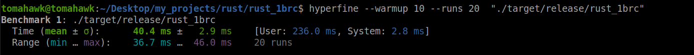

# 1 Billion Row Challange

For aggregrating 1B row with 3 different approch eveluated with (AMD Ryzen 7 3700U , 16 gb Ram) system, with theed pooling and MMap I achieve under 1 second aggregrate response ( 50 - 40 s).

**Update**

For some otimization configration changing threadPool size and CHUNK_SIZE it will make very quick like 35-40ms on same device.

```bash
    hyperfine --warmup 10 --runs 20  "./target/release/rust_1brc"
```



### Create measurements file

```bash
    python3 data/create_measurements.py  1000000000
```
